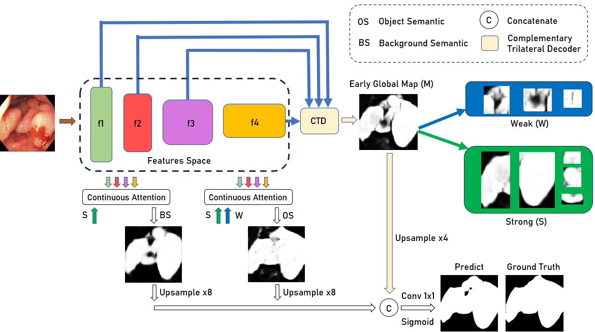

# **ADSNet: Adaptation of Distinct Semantic for Uncertain Areas in Polyp Segmentation [BMVC 2023]** 

[Quang Vinh Nguyen](https://github.com/HashmatShadab), 
Van Thong Huynh,
Soo Hyung Kim,

[](https://arxiv.org/pdf/2405.07523). 

Official PyTorch implementation

<hr />


# :fire: News
* **(September 19, 2024)**
  * Paper accepted at BMVC 2023!🎊
<hr />

## 1. Architecture

<p align="center">

</p>

> **Abstract:** Colonoscopy is a common and practical method for detecting and treating polyps. Segmenting polyps from colonoscopy image is useful for diagnosis and surgery progress. Nevertheless, achieving excellent segmentation performance is still difficult because of polyp characteristics like shape, color, condition, and obvious non-distinction from the surrounding context. This work presents a new novel architecture namely Adaptation of Distinct Semantics for Uncertain Areas in Polyp Segmentation (ADSNet), which modifies misclassified details and recovers weak features having the ability to vanish and not be detected at the final stage. The architecture consists of a complementary trilateral decoder to produce an early global map. A continuous attention module modifies semantics of high-level features to analyze two separate semantics of the early global map. The suggested method is experienced on polyp benchmarks in learning ability and generalization ability, experimental results demonstrate the great correction and recovery ability leading to better segmentation performance compared to the other state of the art
in the polyp image segmentation task. Especially, the proposed architecture could be experimented flexibly for other CNN-based encoders, Transformer-based encoders, and decoder backbones.

## Contents

1) [Highlights](#Highlights) 
2) [Installation](#Installation)
3) [Dataset Preparation](#Dataset-Preparation)
4) [Background Generation](#Background-Generation)
5) [Datasets](#Datasets)
6) [Evaluation](#Evaluation)
7) [Results](#Results)


<a name="Installation"/>

## 💿 Installation

```python
pip install -r requirements.txt
```

<a name="Dataset Preparation"/>

## 🏁 Dataset Preparation:
Download the datasets from [here](https://drive.google.com/file/d/1pFxb9NbM8mj_rlSawTlcXG1OdVGAbRQC/view?usp=sharing) and put them into `polyp/` folder.

## 🚀 Training:
```python
python main.py
```

## 4. Polyp Segmentation Compared Results
We also provide some result of baseline methods, You could download from [Google Drive](https://drive.google.com/file/d/1xvjRl70pZbOO6wI5p94CSpZK2RAUnUnx/view?usp=sharing), including results of compared models.

## 📚 BibTeX
If you have found our work useful, please consider citing:
```bibtex
@article{nguyen2024adaptation,
  title={Adaptation of Distinct Semantics for Uncertain Areas in Polyp Segmentation},
  author={Nguyen, Quang Vinh and Huynh, Van Thong and Kim, Soo-Hyung},
  journal={arXiv preprint arXiv:2405.07523},
  year={2024}
}
```

<hr />

<a name="contact"/>

## 📧 Contact
Should you have any question, please create an issue on this repository or contact at vinhbn28@jnu.ac.kr

<hr />

