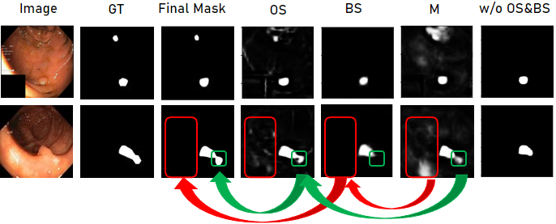
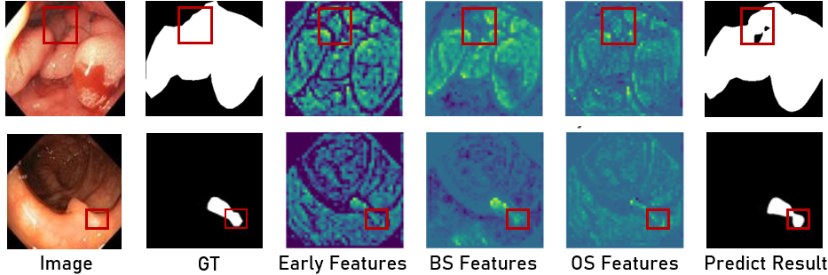

# ADSNet: Adaptation of Distinct Semantic for Uncertain Areas in Polyp Segmentation, BMVC 2023 

Official Pytorch implementation of [ADSNet: Adaptation of Distinct Semantic for Uncertain Areas in Polyp Segmentation](https://proceedings.bmvc2023.org/806/). 
 <br>
<p>Chonnam National University</p>

<b>Author:</b> <b>Quang-Vinh Nguyen, Van-Thong Huynh, Soo-Hyung Kim</b>

In The 34th British Machine Vision Conference, 20th - 24th November 2023, Aberdeen, UK.

## Architecture

<p align="center">

</p>

## Qualitative Results

<p align="center">

</p>

## Contributions of Predicted Masks

<p align="center">

</p>

## Feature Maps

<p align="center">

</p>

## Usage:
### Recommended environment:
Please use ```pip install -r requirements.txt``` to install the libraries.

### Data preparation:
Download the training and testing datasets [Google Drive](https://drive.google.com/file/d/1pFxb9NbM8mj_rlSawTlcXG1OdVGAbRQC/view?usp=sharing) and move them into 'polyp/' folder.

### Training:
Run ```python main.py```

### Polyp Segmentation Compared Results:
We also provide some result of baseline methods, You could download from [Google Drive](https://drive.google.com/file/d/1xvjRl70pZbOO6wI5p94CSpZK2RAUnUnx/view?usp=sharing), including results of compared models.

## :bookmark_tabs: Citation
```
@article{nguyen2024adaptation,
  title={Adaptation of Distinct Semantics for Uncertain Areas in Polyp Segmentation},
  author={Nguyen, Quang Vinh and Huynh, Van Thong and Kim, Soo-Hyung},
  journal={arXiv preprint arXiv:2405.07523},
  year={2024}
}
